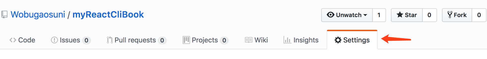
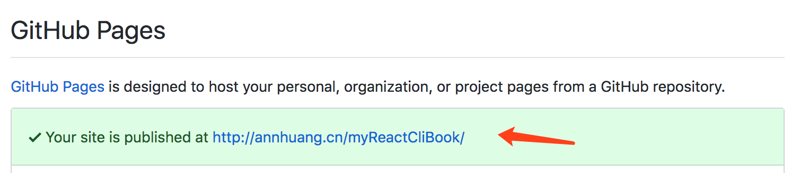

## 安装gitbook

```bash
## 全局安装 gitbook-cli
npm install gitbook-cli -g

## 安装完之后，你可以检验下是否安装成功
gitbook --version
```

## 使用gitbook
`SUMMARY.md` 是书籍的目录结构

使用 `gitbook init`，它会为我们创建 `SUMMARY.md` 中的目录结构

书籍目录结构创建完成以后，就可以使用 `gitbook serve` 来编译和预览书籍了，会自动生成一个 _book 目录

## 编译

写好后如果需要发布到github pages，可以按照以下方法走：

```bash
## 1. outbook 为自定义的静态资源存放目录
mkdir outbook
## 2.
cd..
## 3. 例如gitbook编写的目录名为 xxx ，执行build命令，xxx\outbook下生成了同样的静态html文件
gitbook build xxx xxx/outbook
## 4. 在master分支下，将 xxx/outbook 推送到 gh-pages 分支
git subtree push --prefix=outbook origin gh-pages
```

上面步骤完成后，打开存放文档的仓库设置，即可看到：
<div style="width: 650px">
  
  
</div>

## 目录结构说明

```
.
├── README.md          -------------------------  文档的默认页
├── READMEONLY.md      -------------------------  开发使用的，备忘
├── SUMMARY.md         -------------------------  文档目录
├── _book              -------------------------  gitbook serve 命令后的自动编译文档
└── outbook            -------------------------  使用build参数生成的静态资源目录
├── cli                -------------------------  自己编写文档的目录
├── images             -------------------------  自己编写文档的目录
├── node               -------------------------  自己编写文档的目录
```


## 文档参考

- [gitbook入门教程](https://yuzeshan.gitbooks.io/gitbook-studying/content/index.html)
